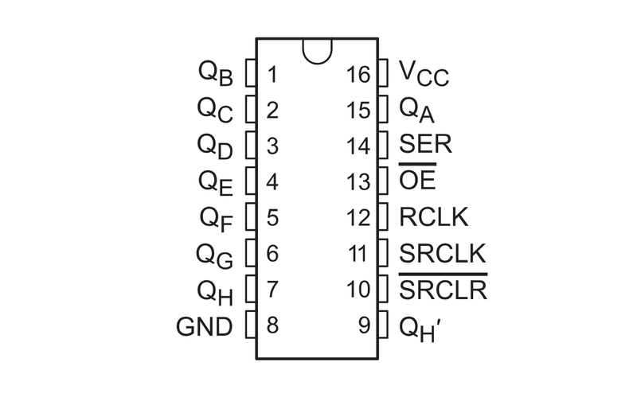
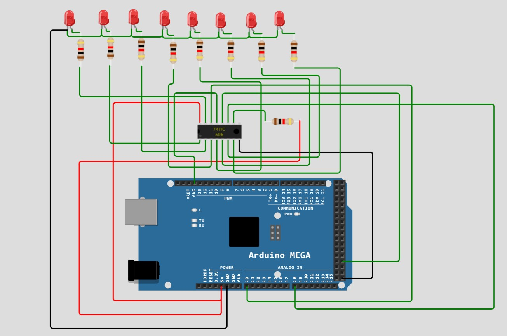
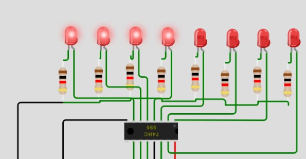

<body>
<h1>Interfacing 74HC595 Shift Register With Atmega2560 (Arduino Mega) </h1>

<strong style="font-size:20px">
We will interface 74HC595 shift register with Arduino Mega,send the input data serially and observe the output data using LEDs.
</strong>

<section>
<h2>Contents</h2>
<ul  style="background-color:#c5d4cc;padding-top: 10px;padding-bottom: 10px;">
<li><a href="#why"><h3>Why use a Shift Register</h3></a></li>
<li><a href="#how"><h3>How 74HC595 shift register Works</h3></a></li>
<li><a href="#pin"><h3>74HC595 Pinout</h3></a></li>
<li><a href="#conn"><h3>Connections</h3></a></li>
<li><a href="#code"><h3>Code</h3></a></li>
<li><a href="#exp"><h3>Code explanation</h3></a></li>
</li>
</ul>
</section>

<section id="why">
<h2>Why Use a 74HC595 Shift Register</h2>
<strong style="font-size:20px">
Have you ever faced problem of having a limited GPIO on your microcontrollers. For example, you want to use 24 LEDs ,but your microcontroller doesn't have enough GPIO pins for 24 LEDs. Then , shift registers will helps you to solve the problem. Instead of sending the input data parallelly to LED's, we will use a shift register where input data is sent serially and output is parallel. Each 74HC595 shift register has 8 output pins and shift register can be chained together where you can connect multiple shift registers. As example mentioned above, we can chain three shift register to use 24 LEDs. 
</section>

<section id="how">
<h2>How 74HC595 Shift Register Works</h2>
<strong style="font-size:20px">
74HC595 has two registers with 8-bits, one of them is shift register.
shift register is used to shift incoming data in register whenever the clock is high, each time clock goes high, bits get shifted to left side of the regsiter.
Data in Bit 0 gets shifted to Bit 1 position, data in Bit 1 gets shifted to Bit 2 position and so on.   

Another register is called latch or storage register, it is used to stored the contents of shift register.When the latch pin is made high, the contents of shifted register is copied to the storage register. Storage register is connected to output pins, if output is enabled, contents of storage regsiter can be seen at the output. 
</strong>

<section id="pin">
<h2>74HC595 Pinout</h2>

<strong style="font-size:20px"> 
Vcc - Connect to +5V of microcontroller 
GND - Connect to Gnd pin of microcontroller  
SER(Serial input) - We use this pin to send the serial data 
SRCLK (Serial clock) - This is the clock pin, when we want to the data in the shift register to be shifted, this pin is made high, during each rising edge bits are shifted in the register. 
RCLK (Regsiter clock)- This is the latch pin, when this pin is made high, contents of shift register copied into latch register and output can be seen. 
SRCLR (shift register clear) - This pin is active low, when this pin is made low, the contents of shift register are cleared, all bits in the shift register are 0's. 
OE (Output Enable) - This pin is active low, when this pin is made low, output can be seen at output pins. 
QA,QB,QC,QD,QE,QF,QG,QH (Output) - when output enable is low, contents of latch regsiter can been at this pins(use LEDs to see the output). 
QH' -  This pin is useful, when multiple shift registers are used. QH' pin of first register is connected to SER pin of second register.
</strong>
</section>

<section id="conn">
<h2>Connections</h2>

<strong style="font-size:20px">
Vcc and GND are connected to +5v and Gnd pin respectively  
SER pin is connected to A0 pin  
SRCLK pin is connected to A8 pin  
RCLK pin is connected to D49 pin  
OE pin connected to GND  
SRCLR pin connected to +5v  
QA to QH pins all are connected to LEDs.
</strong>
</section>

<section id="code">
<h2>Code</h2>
<strong style="font-size:20px">
Here is the code 
</strong>
<code>

void setup() {

  char data = 0x0F;
  init();
  out_ds(0x00);
  out_clk(0x00);
  out_latch(0x00);

  for(int i=0;i<8;i++){
    out_ds((data>>i)&0x01);
    clk_enable();
  }
  latch_enable();
}

void init(){
  char *ddr1 = (char*)0x30;//SER pin
  *ddr1 = 0x01;

  char *ddr2 = (char*)0x107;//SCLK pin
  *ddr2 = 0x01;
  
  char *ddr3 = (char*)0x10A;// RCLK pin
  *ddr3 = 0x01;
}

void out_ds(char data){
  char *out = (char*)0x31;// SER pin
  *out = data;
}

void out_clk(char data){
  char *out = (char*)0x108;// SCLK pin 
  *out = data;
}

void out_latch(char data){
  char *out = (char*)0x10B;// RCLK pin
  *out = data;
}

void clk_enable(){
  out_clk(0x01);
  delay1();
  out_clk(0x00);
  delay1();
}

void latch_enable(){
  out_latch(0x01);
  delay1();
  out_latch(0x00);
  delay1();
}

void delay1(){
  volatile long i;
  for(i=0;i<100;i++);
}

void loop() {
  // put your main code here, to run repeatedly:

}
</code>
</section>

<section id="exp">
<h2>Code Explanation</h2>
<code>

void init(){
    
  char *ddr1 = (char*)0x30;//SER pin
  *ddr1 = 0x01;

  char *ddr2 = (char*)0x107;//SCLK pin
  *ddr2 = 0x01;
  
  char *ddr3 = (char*)0x10A;// RCLK pin
  *ddr3 = 0x01;

}
</code>
This function is used to initialize the data direction of the SER(A0), SCLK(pin A8),RCLK(pin D49).A0 pin is the pin 0  of port F, A8 pin is the pin 0 of port K and D49 pin is the pin 0 of port L. All of them are used as output , so 0x01 is written to their data direction register of their respective ports.   

<code>

void out_ds(char data){
  char *out = (char*)0x31;// SER pin
  *out = data;
}

void out_clk(char data){
  char *out = (char*)0x108;// SCLK pin 
  *out = data;
}

void out_latch(char data){
  char *out = (char*)0x10B;// RCLK pin
  *out = data;
}

</code>
These three functions are used to send the output data to their connected pins i.e SER,SCLK,RCLK of the shift register. 

<code>

void clk_enable(){
  out_clk(0x01);
  delay1();
  out_clk(0x00);
  delay1();
}

</code>
This function is called when we want the data to be shifted in the register, this function makes Serial clock high for certain time and back to low again. During the rising edge of the clock, bits in shift register are shifted. This function is called after the each bit is sent to 
SER pin.  

<code>

void latch_enable(){
  out_latch(0x01);
  delay1();
  out_latch(0x00);
  delay1();
}

</code>
This function is called when we want the data in the shifted regsiter to be copied to latch/storage register. This function is called after sending all the required data to SER pin. 

<code>

void setup() {
  char data = 0x0F;
  init();
  out_ds(0x00);
  out_clk(0x00);
  out_latch(0x00);

  for(int i=0;i<8;i++){
    out_ds((data>>i)&0x01);
    clk_enable();
  }
  latch_enable();
  delay1();
}

</code>
In the main function, data variable is the data we want to send through SER pin, we initialize data,clk,latch pins to 0 at first.  

Inside the for loop, we send each bit at a time , after sending each bit, we call clk_enable() function to make clock high so that data gets shifted in the shift register.   

After sending 8 bits of data, we call latch_enable to enable the RCLK , so that contents of shift register are copied to storage register and output can been through LEDs. 
</section>

<h2>Final output <h2>

</body>